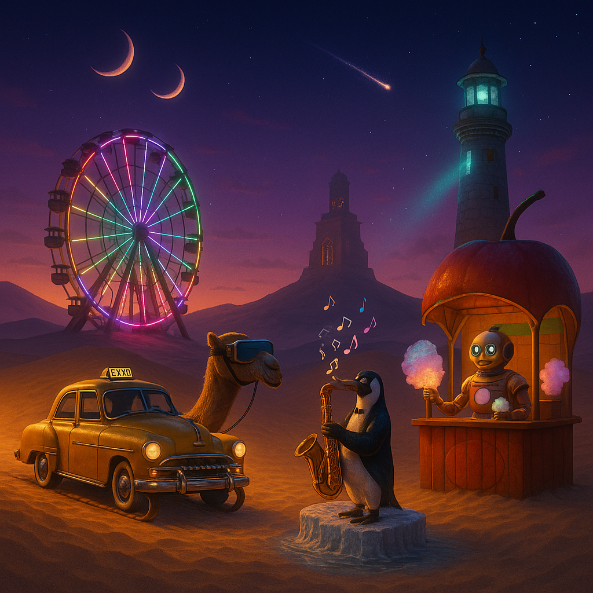
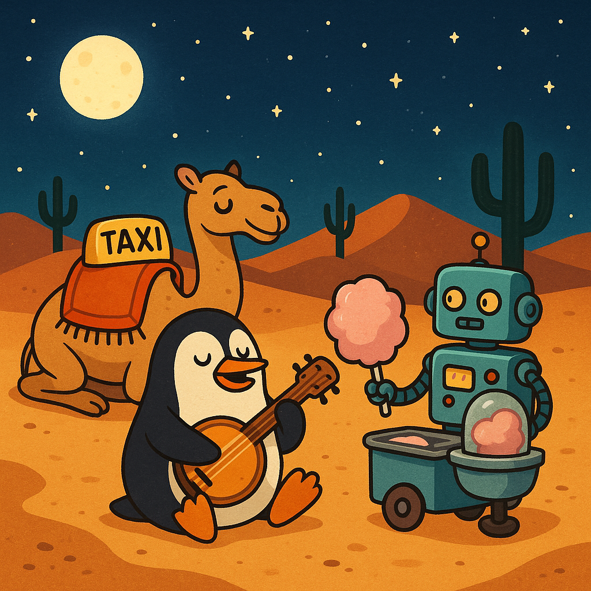
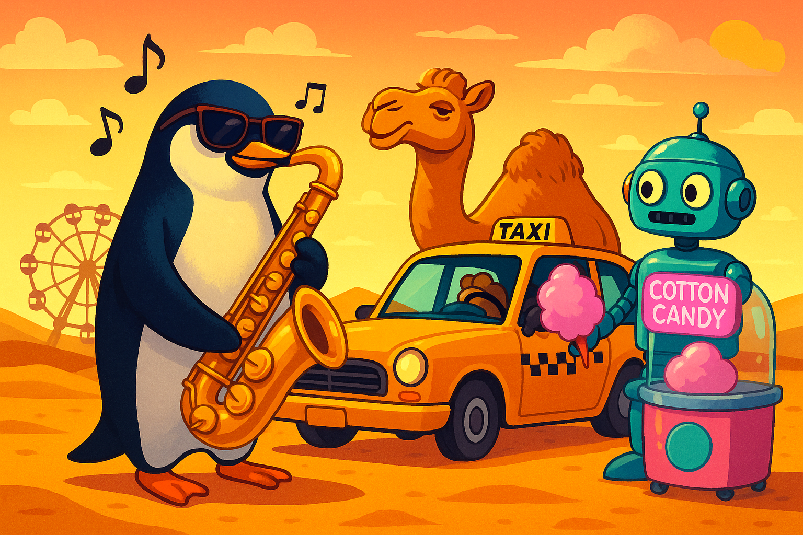
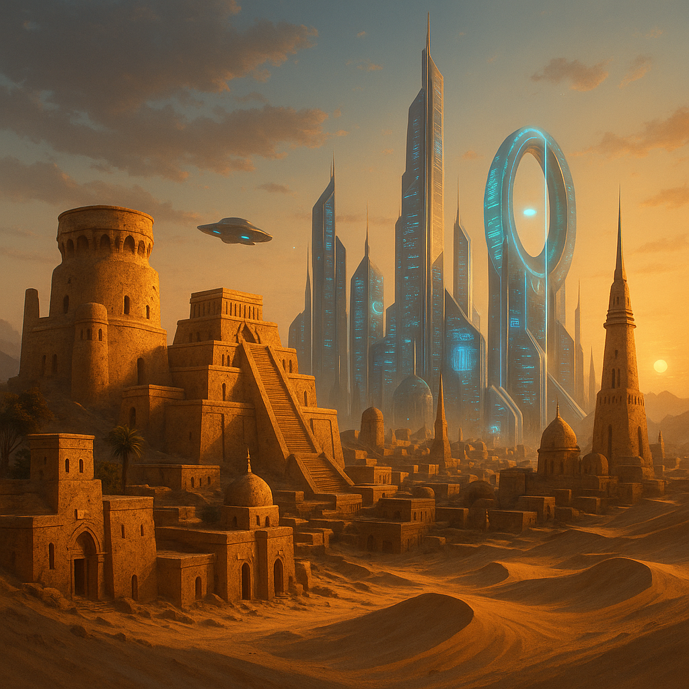
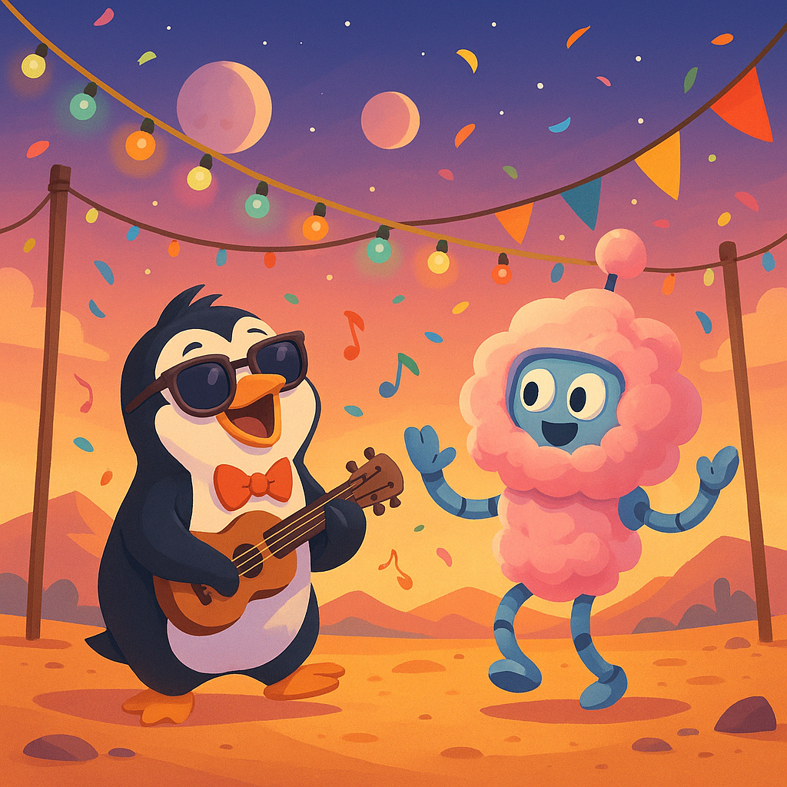
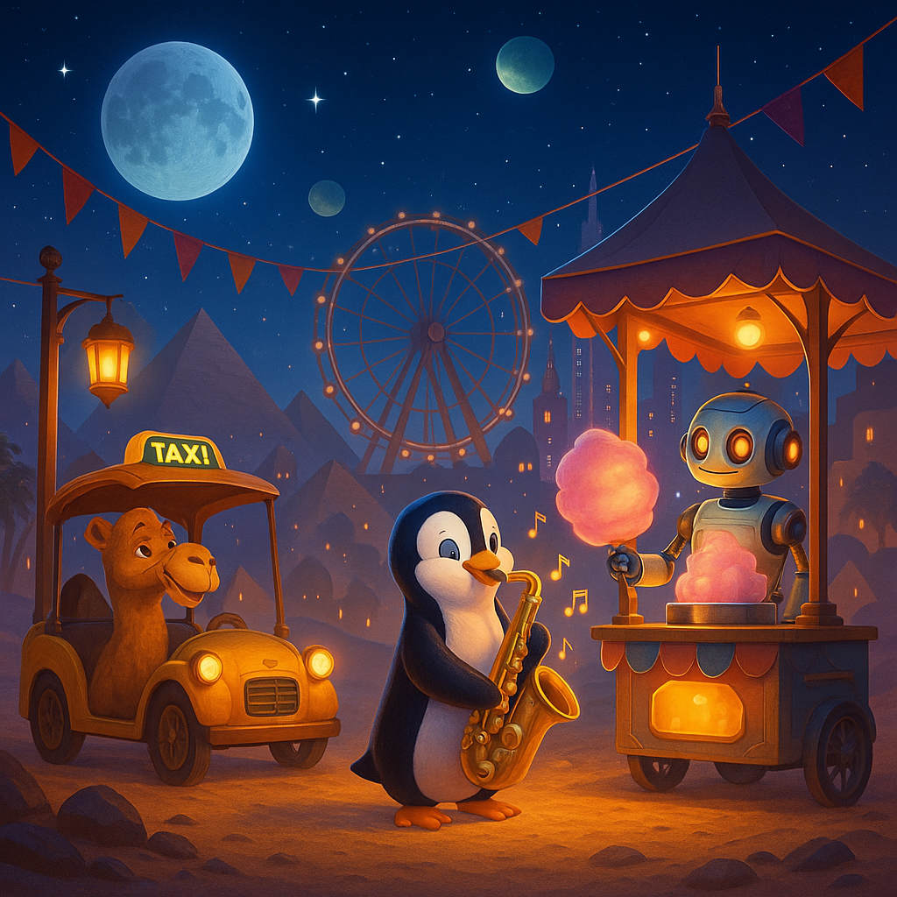

# Perspective Blending: How Multiple Viewpoints Beat Single Sources

> A 60-second memory test reveals why orchestrating multiple AI agents produces superior results to any single agent.

## TL;DR

When four engineers described a complex scene from memory, their individual AI-generated reconstructions were fragmented. Merging the four descriptions into a single prompt yielded a far more faithful reconstruction.

This demonstrates a key principle: **a synthesized collection of diverse perspectives is more powerful than any single viewpoint**, whether those perspectives come from humans or independent AI agents.

## The Hypothesis

Multiple independent observers capture complementary details that, when synthesized, produce more complete results than any single observer—no matter how capable.

## The Experiment

1. **Source Image**
    
   We generated a deliberately complex *"neon-desert carnival"* scene packed with surreal details: a VR-goggled camel taxi, saxophone-playing penguin, neon Ferris wheel, hovering lighthouse, and twin moons.
    
   
3. **Isolation Test**
    - Four engineers each viewed the image for **60 seconds**.
    - Working in isolation, each wrote a **1-3 sentence** description from memory.
    - Each description was fed to ChatGPT to generate a reconstruction.
4.  **Blended Test** 
    All four descriptions were concatenated into a single, combined prompt and fed to the same model.

## Individual Reconstructions

Each description captured different, valid elements, but no single one saw the whole picture.

| Engineer | What They Remembered                                                                                                                                  | AI Reconstruction                                                                         |
| -------- | ----------------------------------------------------------------------------------------------------------------------------------------------------- | ----------------------------------------------------------------------------------------- |
| **A**    | "It's a penguin playing an instrument in the desert during the night. There is a camel taxi listening and a Robot selling cotton candy."              |  |
| **B**    | "There's a penguin play saxophone in the dessert with a ferris wheel behind it. There's a taxi with a camel in it. And a robot selling cotton candy." |  |
| **C**    | "a city in the desert with things from the past and things from the future"                                                                           |  |
| **D**    | "A Disney vibed desert party with a musical penguin and a candy floss robot on a distant planet with two moons."                                      |  |

## Blended Reconstruction

This prompt is a simple concatenation of the four descriptions above. The result is dramatically more comprehensive.

## Side-by-Side Comparison

| Original Source                                                           | Blended Reconstruction                                                                          |
| ------------------------------------------------------------------------- | ----------------------------------------------------------------------------------------------- |
|  |  |

The blended version captures nearly every major element—something no individual description achieved.

## Key Insights

1.  **Unique Details Emerge from Diverse Perspectives.** 
    Each engineer contributed distinct details the others missed—the twin moons, the "Disney vibe," the abstract "past and future" concept. Merging them filled critical gaps.
2.  **Synthesis Unlocks Value.** 
    The individual descriptions had latent potential. The value was only unlocked through the deliberate (and simple) act of combining them. Orchestration is not overhead; it's the mechanism of value creation.
3.  **High Return on Minimal Effort.** 
    The cost of this improvement was trivial: four brief, parallel efforts and one final concatenation. This suggests a highly efficient path to better results in complex tasks.

## "Why Not Just Use Best-of-N Sampling?"

This is the critical question. The answer lies in the difference between *parametric variety* and *perspective variety*.

- **Best-of-N (Intra-Model Variety):** Asking one model for multiple outputs explores its *internal* possibility space. It's like asking one person to brainstorm five ideas. The ideas will differ, but they all stem from the same core knowledge, biases, and blind spots. It provides **parametric variety**.
- **Independent Agents (Inter-Agent Variety):** Using different models (or humans) introduces fundamentally different viewpoints. Each agent has its own "salience map"—its own sense of what's important. This introduces truly novel information that the original model might never generate on its own. It provides **perspective variety**.

In our experiment, no amount of regenerating from a single description would have added the missing moons or changed "instrument" to "saxophone." Only independent observers contributed genuinely novel information.

## Take-Away

For any complex, exploratory, or creative task, resist relying on a single AI agent.

**Run multiple independent agents in parallel and synthesize their outputs.**

This "perspective blending" approach leverages the unique strengths of each agent, systematically covers blind spots, and produces a more robust and comprehensive result with minimal overhead.

## Try It Yourself

1. Clone this repo
2. Show `source.png` to 3-4 people for exactly 60 seconds
3. Collect their 1-3 sentence descriptions (keep them isolated)
4. Feed descriptions individually to an image generator, then all together
5. Compare the results—the difference is striking

- [Session Template](https://docs.google.com/presentation/d/1hMcf3Dawsmo6ndWVRlt4bqDoSWEkPZ5uijR3nLqMwa8/edit?slide=id.g36471f7fef4_0_0#slide=id.g36471f7fef4_0_0)
- [Example from Team Datastores](https://docs.google.com/presentation/d/12daw1CEY_4biXDFlu0aXo8Fm4GFELggzTBw0_QVMWt8/edit?slide=id.g36471f7fef4_0_0#slide=id.g36471f7fef4_0_0)
